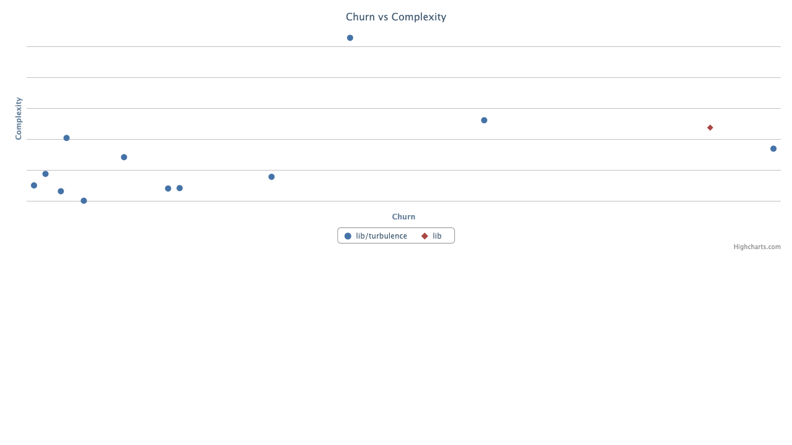
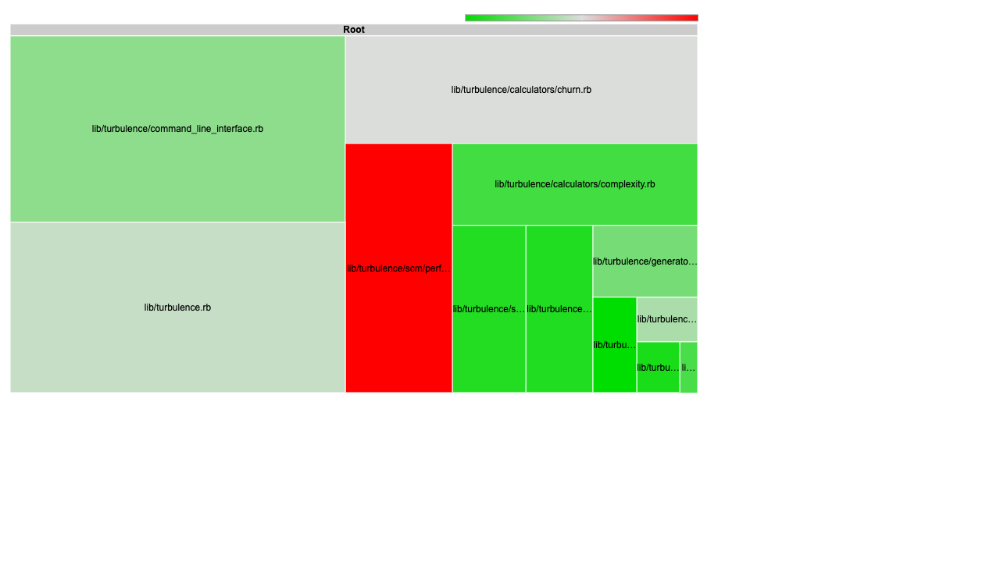

# Turbulence

[](https://github.com/chad/turbulence/actions/workflows/ci.yml)
[](https://badge.fury.io/rb/turbulence)

Turbulence visualizes churn vs complexity for your Ruby codebase, helping you identify files that are both highly complex and frequently changed - prime candidates for refactoring.

Based on Michael Feathers' work on [getting empirical about refactoring](https://www.stickyminds.com/article/getting-empirical-about-refactoring).

## Screenshots

### Scatter Plot (default)



### Treemap



## How to Read the Graph

The scatter plot places each file according to its **churn** (x-axis) and **complexity** (y-axis):

| Quadrant | Location | What it means |
|----------|----------|---------------|
| **Danger Zone** | Upper right | High complexity + high churn. These files change often and are hard to work with. Prime refactoring candidates! |
| **Healthy Closure** | Lower left | Low complexity + low churn. Stable, well-factored code. Leave it alone. |
| **Cowboy Code** | Upper left | High complexity + low churn. Complex code that sprang from someone's head fully formed. May need attention if it starts changing. |
| **Fertile Ground** | Lower right | Low complexity + high churn. Often configuration or incubators for new abstractions. Code grows here, then gets extracted. |

## Requirements

- Ruby 3.0 or later
- Git or Perforce

## Installation

```bash
gem install turbulence
```

## Usage

In your project directory, run:

```bash
bule
```

This generates and opens `turbulence/turbulence.html` with an interactive scatter plot.

### Options

```bash
bule [options] [directory]

Options:
  --scm p4|git          SCM to use (default: git)
  --churn-range A..B    Commit range to compute file churn
  --churn-mean          Calculate mean churn instead of cumulative
  --exclude PATTERN     Exclude files matching pattern
  --treemap             Output treemap graph instead of scatter plot
  --no-open             Skip opening the report in a browser
  --output DIR          Output directory for reports (default: ./turbulence)
```

### Examples

```bash
# Analyze current directory
bule

# Analyze a specific directory
bule path/to/project

# Use Perforce instead of Git
bule --scm p4

# Analyze only recent changes
bule --churn-range HEAD~100..HEAD

# Generate report without opening browser (useful for CI)
bule --no-open

# Output to a custom directory
bule --output spec/reports/turbulence

# Exclude test files
bule --exclude spec
```

### Perforce Support

For Perforce, set the `P4CLIENT` environment variable to your client workspace name:

```bash
export P4CLIENT=my-workspace
bule --scm p4
```

## Privacy Warning

Turbulence generates a JavaScript file containing your file paths and names. If these are sensitive, be careful where you put the generated files and who you share them with.

## Contributing

Bug reports and pull requests are welcome on [GitHub](https://github.com/chad/turbulence).

## License

[MIT License](LICENSE.txt)

## Authors

- [Chad Fowler](https://github.com/chad)
- [Michael Feathers](https://github.com/michaelfeathers)
- [Corey Haines](https://github.com/coreyhaines)
